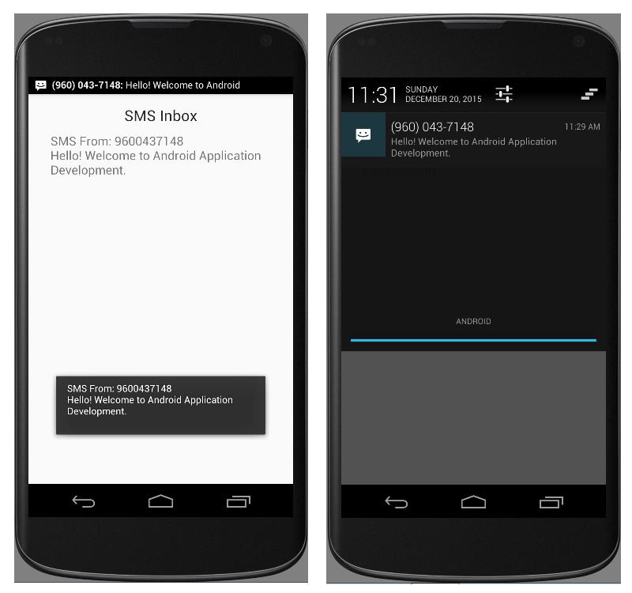

# EXNO:10 - Message Alert

## AIM
To develop an application that creates an alert upon receiving a message using Android Studio mobile application development framework.

## PROCEDURE
1. Create a new project with blank activity and a Java class extending Activity and implementing OnItemClickListener.
2. Design the UI using TextView and ListView widgets.
3. Use the `query()` method of ContentResolver to fetch SMS inbox content as a Cursor.
4. Extract SMS address and body from Cursor and use ArrayAdapter to bind it to the ListView.
5. Define `onItemClick()` to show selected SMS as a Toast.
6. Create a BroadcastReceiver class to handle incoming SMS using `onReceive()`.
7. Update the UI from the BroadcastReceiver by accessing the Activity instance.
8. Declare necessary permissions for SMS read/write/receive in AndroidManifest.xml.
9. Use a custom icon as launcher icon.
10. Run on emulator and simulate incoming SMS via emulator controls.

## OUTPUT

## RESULT
Thus an Android mobile application that creates an alert upon receiving a message was developed and executed.
