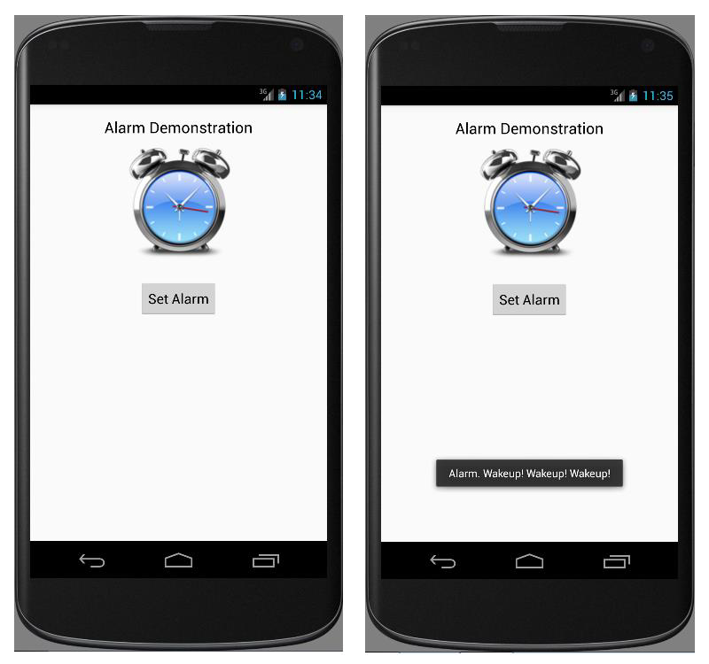

# EXNO:11 - Alarm Clock

## AIM
To develop an alarm clock using Android Studio mobile application development framework.

## PROCEDURE
1. Create a new project with blank activity and Java class which extends `Activity`.
2. Design the application using widgets such as `TextView`, `ImageView`, and `Button`.
3. Relate the functionality of invoking the alarm with a button using `onClick` method.
4. Declare objects for `AlarmManager`, `PendingIntent`, and `BroadcastReceiver`.
5. Use `set()` method of `AlarmManager` to set RTC_WAKEUP and time.
6. Register `BroadcastReceiver` to trigger `onReceive()` on alarm time.
7. Show message using `Toast.makeText()` as alarm alert.
8. Run the application on an emulator.

## OUTPUT

## RESULT
Thus, an Android mobile application to demonstrate alarm clock was developed and executed.
