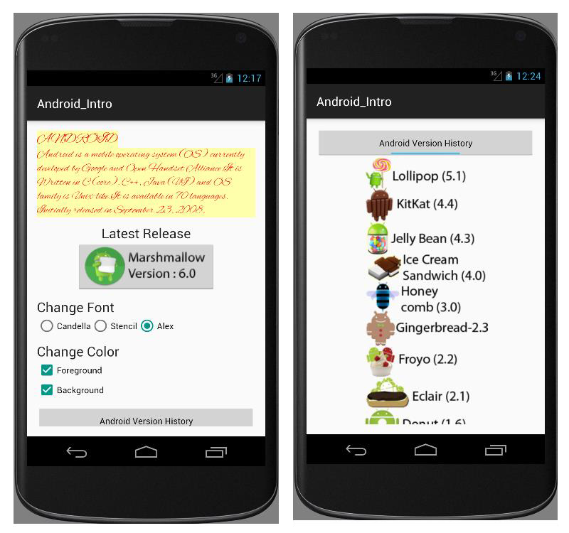

# EXNO:01 — GUI Components, Font and Colours

## AIM:
To develop an application that uses GUI components, font styles, and color changes using the Android Studio mobile application development framework.

## PROCEDURE:
1. **Create a New Project:** Initialize a blank activity and extend the AppCompatActivity class in a new Java file.
2. **Design the GUI:** Use various GUI components like `TextView`, `Button`, `ImageButton`, `RadioButton`, `CheckBox`, and `ToggleButton` in the layout XML file.
3. **Font Functionality:** Implement font style changes in the Java code using radio buttons and asset fonts (Candella, Stencil, Alex).
4. **Color Functionality:** Use checkboxes to allow foreground and background color changes dynamically.
5. **Toast Messages:** Display Android version release information using `Toast`.
6. **Image Toggle:** Use a toggle button to show/hide Android version history using `ImageView`.
7. **Launcher Icon:** Customize the application’s launcher icon using the Asset Studio wizard.
8. **Testing:** Run the application on an emulator to verify its functionality.

## OUTPUT:
The following image illustrates the output screens as seen on an Android emulator.

### App Output Screenshot:

## RESULT:
Thus, an Android mobile application that uses GUI components, font selection, and color customization was successfully developed and executed using Android Studio.
