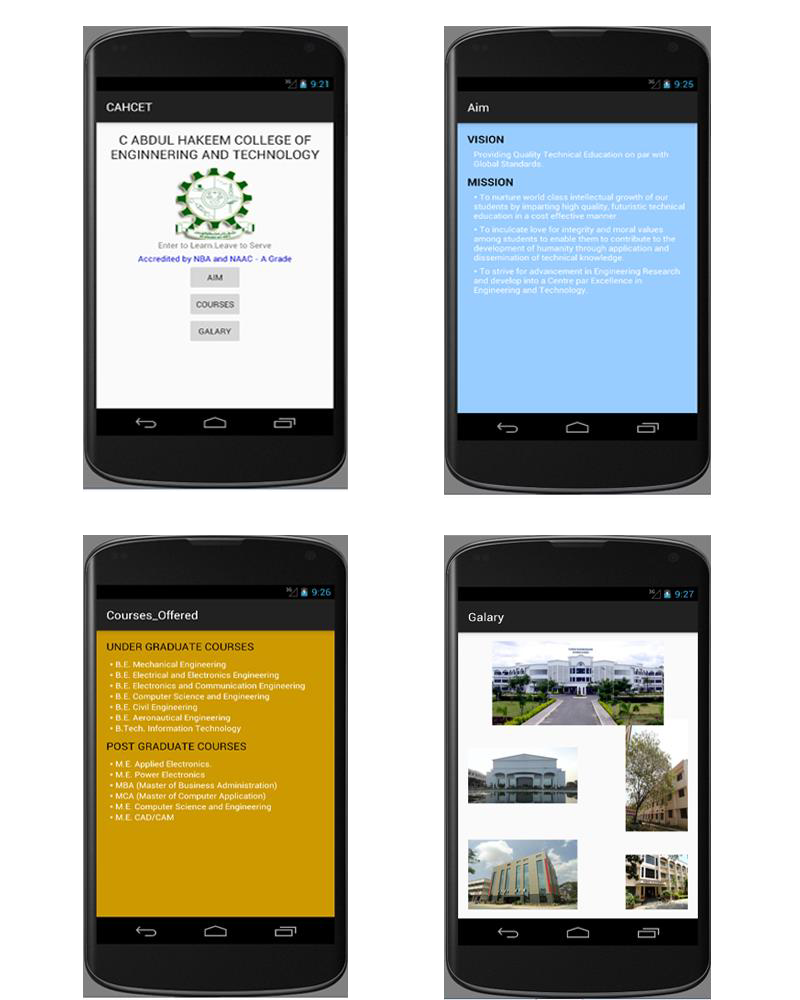

# EXNO: 02 — Layout Managers and Event Listeners

## AIM
To develop an application that uses Layout Managers and Event listeners using the Android Studio mobile application development framework.

## PROCEDURE
1. Create a new project with a blank activity and a Java class that extends the `AppCompatActivity` parent class.
2. Design the launcher activity using `RelativeLayout` and incorporate UI widgets such as `TextView`, `Button`, and `ImageView`.
3. Create a new activity using `LinearLayout` and add suitable `TextView` elements for displaying the institutional vision and mission.
4. Create a `GridLayout` based activity to list undergraduate and postgraduate courses using `TextView` components.
5. Create another activity using `FrameLayout` and use `ImageView` to display campus images.
6. Link the created activities to the launcher activity through `Button` widgets.
7. Implement event listeners for each button using the `OnClickListener` interface.
8. Launch respective activities via the `Intent` class upon user interaction.
9. Declare and configure all activities in the `AndroidManifest.xml` file using intent filters.
10. Replace the default launcher icon using the Asset Studio wizard available in Android Studio.
11. Execute the application on an Android emulator to verify its functionality.

## OUTPUT

The following screenshot showcases the functioning of the developed Android application:

## RESULT
Thus, an Android mobile application utilizing various Layout Managers (`RelativeLayout`, `LinearLayout`, `GridLayout`, and `FrameLayout`) and implementing event listeners was successfully created, executed, and validated through an emulator. The application demonstrates the ability to manage multiple user interfaces and navigation logic effectively.
