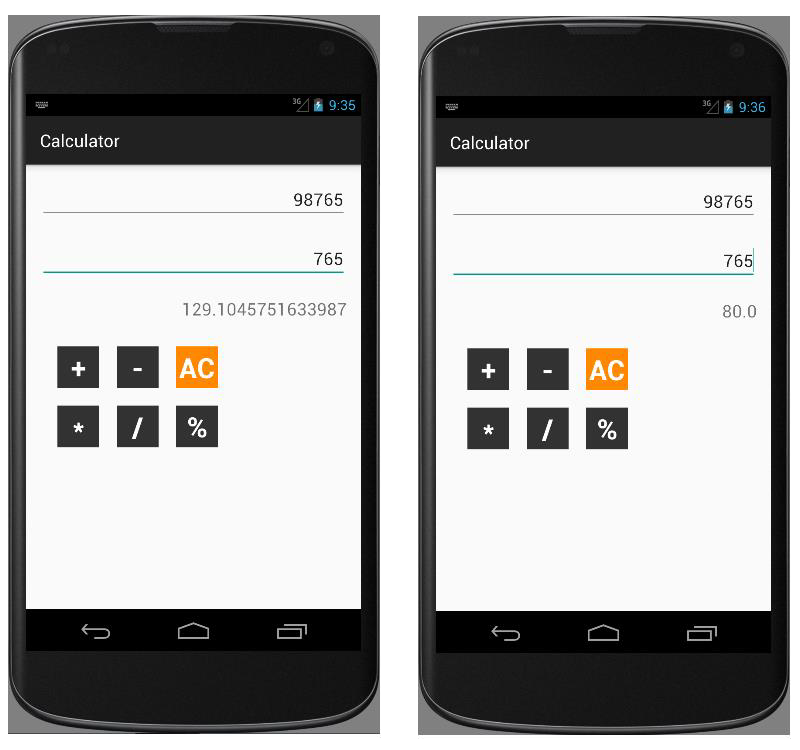

# EXNO:03 - CALCULATOR

## AIM
To develop a native calculator application using Android Studio mobile application development framework.

## PROCEDURE
1. Create a new project with a blank activity and Java class that extends `AppCompatActivity`.
2. Design the application with necessary widgets such as `EditText` for inputs, `TextView` for displaying results, and `Button` for arithmetic operations.
3. Implement the logic for each arithmetic operation and bind them to the respective buttons.
4. Handle the operations inside the `onClick()` method.
5. Display the result using a `TextView`.
6. Replace the launcher icon using Asset Studio wizard.
7. Run the application on the emulator.

## OUTPUT

## RESULT
Thus, a native calculator Android mobile application was successfully developed and executed.
