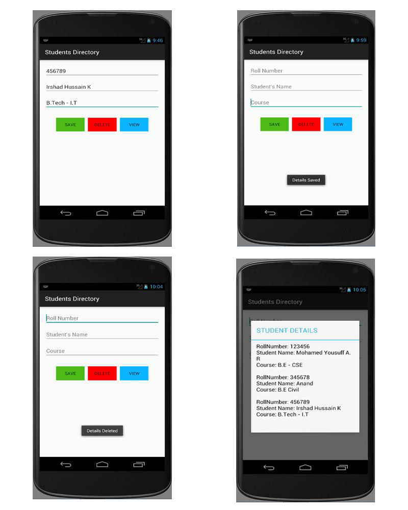

# EXNO:05 - Demonstration of Database

## AIM
To develop an application that makes use of a database using Android Studio mobile application development framework.

## PROCEDURE
1. Create a new project with a blank activity and a Java class extending AppCompatActivity.
2. Design the layout using EditText widgets for input and Buttons for database operations.
3. Implement button click methods to perform Save, Delete, and View operations.
4. Create a database handler class extending SQLiteOpenHelper.
5. Implement methods in the handler class for creating, inserting, deleting, and retrieving records.
6. Replace the default launcher icon using Asset Studio wizard.
7. Run the application on an emulator.

## RESULT
Thus, an Android mobile application that makes use of a database was successfully developed and executed.
