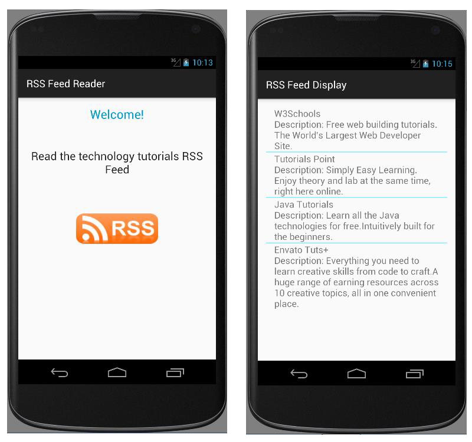

# EXNO:06 - RSS Feed Reader

## AIM
To develop an application that makes use of a RSS Feed using Android Studio mobile application development framework.

## PROCEDURE
1. Create a new project with blank activity and java class which extends AppCompatActivity parent class.
2. Design the application with TextView widgets and ImageButton widget.
3. Create a RSS XML file and place it in Asset folder.
4. Create a new blank activity and Java class which extends AppCompatActivity.
5. Design the new activity with ListView widget to display each RSS feed item.
6. Create a Java bean class with member variables, getters and setters matching the XML structure.
7. Create a SAX handler class that extends DefaultHandler.
8. Override parsing methods to extract tag content.
9. Create a SAX parser class to process the RSS XML file.
10. Use an ArrayAdapter to feed parsed content into the ListView.
11. Implement setOnItemClickListener to open RSS links in the browser.
12. Run the application using an emulator.

## OUTPUT

## RESULT
Thus, an Android mobile application that makes use of a RSS feed was developed and executed.