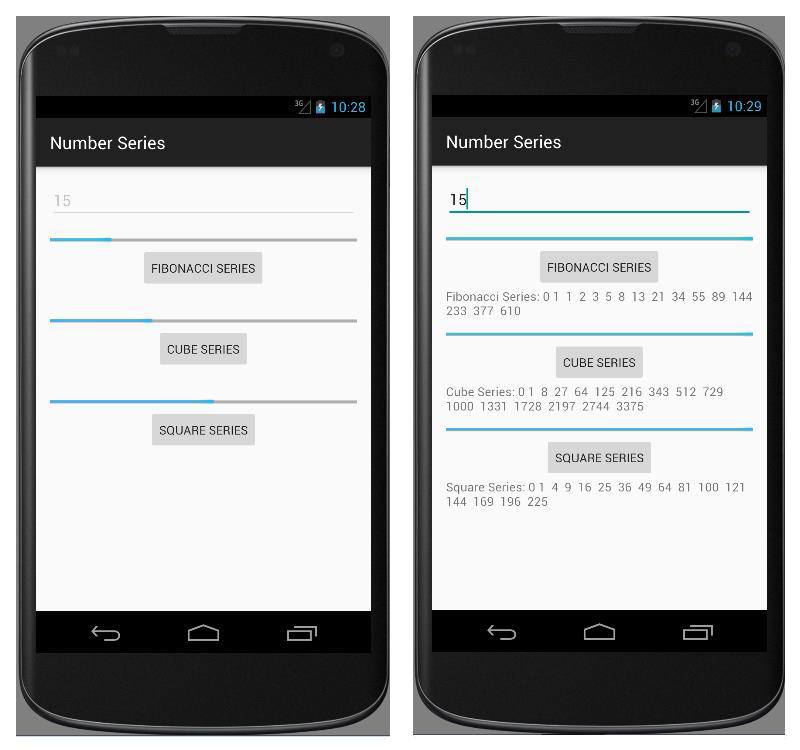

# EXNO:07 - Multi Threading

## AIM
To develop an application that implements multi-threading using Android Studio mobile application development framework.

## PROCEDURE
1. Create a new project with blank activity and Java class extending AppCompatActivity.
2. Design the application with EditText, Button, ProgressBar, and TextView widgets.
3. Accept number series limit from the user as input.
4. Launch separate threads for Fibonacci, Cube, and Square series calculations.
5. Start each thread through the corresponding button click.
6. Track thread execution using ProgressBar for each operation.
7. Replace the launcher icon using Asset Studio.
8. Execute the application on the emulator.

## OUTPUT

## RESULT
Thus an Android mobile application that implements multi-threading was developed and executed.