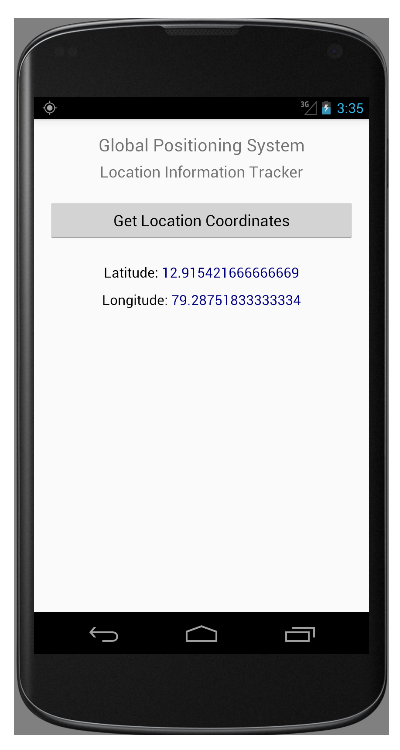

# EXNO:08 - GPS Location Information

## AIM
To develop an application that uses GPS location information using Android Studio mobile application development framework.

## PROCEDURE
1. Create a new project with blank activity and a Java class extending Activity and implementing `LocationListener`.
2. Design the layout with `TextView` and `Button` widgets to display GPS coordinates.
3. Use `LocationManager` to access location services.
4. Override `onLocationChanged()` to retrieve and update coordinates.
5. Request location updates in `onResume()` method.
6. Handle permissions in `AndroidManifest.xml`.
7. Run the application on an emulator and simulate GPS data.

## OUTPUT

## RESULT
Thus, an Android mobile application that uses GPS location information was developed and executed.
