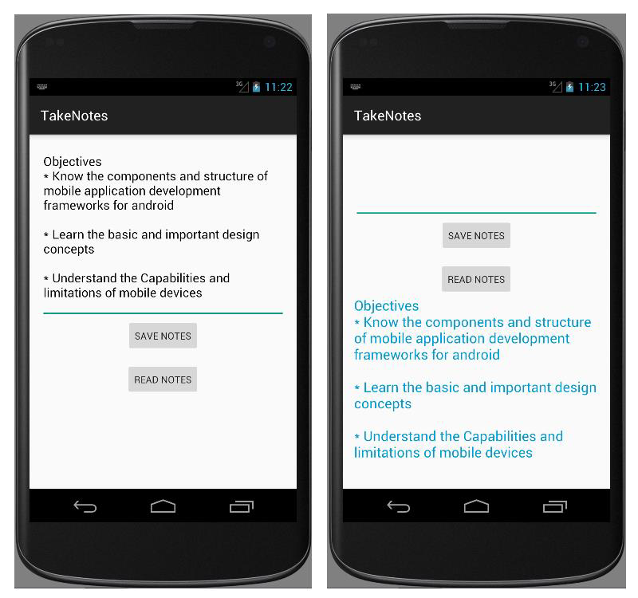

# EXNO:09 - Writing Data to SD Card

## AIM
To develop an application that writes data to the SD card using Android Studio mobile application development framework.

## PROCEDURE
1. Create a new project with a blank activity and a Java class extending AppCompatActivity.
2. Design the application with EditText, Buttons and TextView widgets.
3. Use the `getExternalStorageState()` and `getExternalStorageDirectory()` methods of `Environment` class.
4. Perform write operations using `FileOutputStream`.
5. Perform read operations using `FileInputStream` and `BufferedReader`.
6. Display read content in a `TextView`.
7. Declare read/write permissions in `AndroidManifest.xml`.
8. Replace the launcher icon using Asset Studio.
9. Run the application in an emulator with external storage access.

## OUTPUT

## RESULT
Thus, an Android mobile application that writes data to the SD card was developed and executed successfully.
